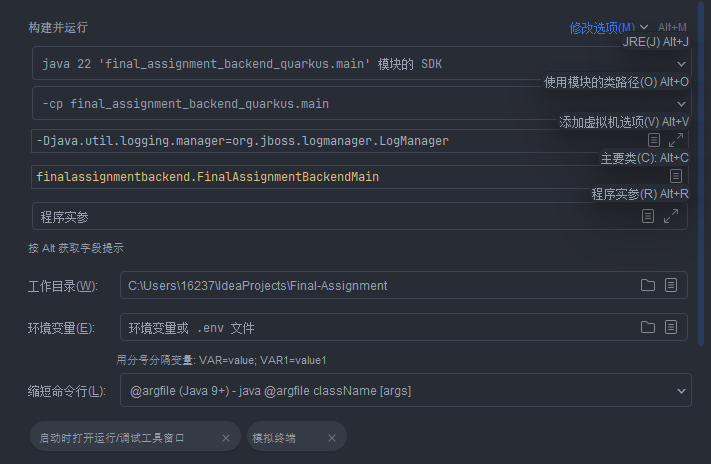

# Final-Assignment （一个开发中的毕设）

这是一个交通违法行为处理管理系统项目，此项目采用Flutter前端与Java后端架构（Quarkus/Spring Boot
3）实现，未来考虑结合Flutter，将此项目开发成鸿蒙应用以支持多端适配。

<font size=2>`四百提交了，多少有点感悟。感觉写代码按照心法来分的话，可以分成just for money 和 just for fun（林纳斯自传名），不同心法练出不同“内功”，just for fun 心法练的就类似于小无相功。`</font>

- **运行代码之前需要确保docker在后台运行。**

*********************************************

## Quarkus

基于Quarkus框架的交通管理系统后端实现，关键依赖特性：

- 🛠 **核心架构**：Vert.x异步驱动 + Quarkus DI容器 + GraalVM原生编译支持
- 🔐 **安全体系**：JWT令牌鉴权 + BCrypt加密 + 细粒度权限控制
- 🚀 **核心功能**：
    - 违法数据管理（MyBatis Plus + MySQL）
    - Kafka实时消息处理（Vert.x集成）
    - 多级缓存策略（Redis + Quarkus Cache）
- 🔧 **性能优化**：
    - GraalVM Native Image构建（启动时间<0.5s / 内存占用<100MB）
    - 响应式消息流（Smallrye Reactive）
    - 使用本地 DeepSeek AI 服务（langchain4j ollama）
- 📘 **开放能力**：OpenAPI 3.0规范文档自动生成

#### IntelliJ IDEA运行配置



#### application.properties参考：

``` properties

# Suppress inspection "SpringBootApplicationProperties" for whole file
%dev.quarkus.http.port=8080
# Database settings
quarkus.datasource.db-kind=mysql
quarkus.datasource.jdbc.url=jdbc:mysql://localhost:3306/cesi?useUnicode=true&characterEncoding=UTF-8&autoReconnect=true&useSSL=false&zeroDateTimeBehavior=convertToNull&serverTimezone=Asia/Shanghai
quarkus.datasource.jdbc.driver=com.mysql.cj.jdbc.Driver
quarkus.datasource.username=xxx
quarkus.datasource.password=xxx
# MyBatis Plus settings
quarkus.mybatis.xmlconfig.enable=false
quarkus.mybatis.environment=development
quarkus.mybatis-plus.pagination.enabled=true
quarkus.mybatis.map-underscore-to-camel-case=true
# Cache settings
quarkus.cache.enabled=true
quarkus.cache.redis.enabled=true
quarkus.cache.redis.serializer=jackson # Verify if 'serializer' is the correct key
quarkus.cache.redis.codec=json # If 'codec' is required instead of 'value-encoder'
quarkus.cache.redis.default-ttl=10M # Ensure the key is 'default-ttl' not 'default-entry-ttl'
quarkus.cache.redis.ignore-null-values=true
quarkus.cache.redis.allow-null-values=false
# Cache configurations for specific services
quarkus.cache.redis.appealCache.value-type=finalassignmentbackend.service.AppealManagementService
quarkus.cache.redis.backupCache.value-type=finalassignmentbackend.service.BackupRestoreService
quarkus.cache.redis.deductionCache.value-type=finalassignmentbackend.service.DeductionInformationService
quarkus.cache.redis.driverCache.value-type=finalassignmentbackend.service.DriverInformationService
quarkus.cache.redis.fineCache.value-type=finalassignmentbackend.service.FineInformationService
quarkus.cache.redis.loginCache.value-type=finalassignmentbackend.service.LoginLogService
quarkus.cache.redis.offenseCache.value-type=finalassignmentbackend.service.OffenseInformationService
quarkus.cache.redis.operationCache.value-type=finalassignmentbackend.service.OperationLogService
quarkus.cache.redis.permissionCache.value-type=finalassignmentbackend.service.PermissionManagementService
quarkus.cache.redis.roleCache.value-type=finalassignmentbackend.service.RoleManagementService
quarkus.cache.redis.systemLogCache.value-type=finalassignmentbackend.service.SystemLogsService
quarkus.cache.redis.systemSettingsCache.value-type=finalassignmentbackend.service.SystemSettingsService
quarkus.cache.redis.userCache.value-type=finalassignmentbackend.service.UserManagementService
quarkus.cache.redis.vehicleCache.value-type=finalassignmentbackend.service.VehicleInformationService
# Configure a Caffeine cache named "driverInfoCache"
quarkus.cache.caffeine."driverInfoCache".expire-after-write=5M
quarkus.cache.caffeine."driverInfoCache".maximum-size=100
# Logging configurations
quarkus.log.level=INFO
quarkus.log.category."io.quarkus".level=INFO
quarkus.log.category."io.vertx".level=INFO
# Native image build
quarkus.native.builder-image=true
# JWT Secret Key
quarkus.smallrye-jwt.silent=false
jwt.secret.key=XXXXXXXXXXXXXXXXXXXXXXXXXXXXXXXXXXXXXXXXXXX=
quarkus.smallrye-jwt.enabled=true
mp.jwt.verify.allowed-algorithms=HS256
mp.jwt.verify.issuer=tutict
mp.jwt.verify.audiences=tutict_client
# Network configurations
network.server.port=8081
backend.url=http://localhost
ws.url=ws://localhost:8081
backend.port=8080
# CORS settings
quarkus.http.cors=true
quarkus.http.cors.origins=http://localhost:10086
quarkus.http.cors.methods=GET,POST,PUT,DELETE,OPTIONS
quarkus.http.cors.headers=Content-Type,Authorization
quarkus.http.cors.exposed-headers=Content-Type,Authorization
quarkus.http.cors.access-control-allow-credentials=true
# deepseek settings
quarkus.langchain4j.ollama.base-url=http://localhost:11434
quarkus.langchain4j.ollama.chat-model.model-id=deepseek-r1:7b

```

## Spring Boot

**<span style="color:#e74c3c">我先集中精力开发SpringBoot代码，因为毕设有DDL了....</span>**

#### 技术架构

- 🚀 **核心框架**  
  Spring Boot 3.4.4 + Graalvm 24 
- 🛠 **数据层**  
  MyBatis Plus 3.5.10.1 + MySQL 8.0.41 + Redis 多级缓存
- **docker**
  基于testcontainers, 使用 Redis + Redpanda(Kafka) + ElasticSearch 8
- **AI**
     - 使用本地 DeepSeek AI 服务（ollama），并利用Graalpy，实现本地模型通过Python爬虫脚本爬取数据来进行联网
     - 为了此项目微调的deepseek-r1:8b模型文件，已上传HuggingFace仓库，地址：https://huggingface.co/4513P/deepseek-for-my-bishe/tree/main
      

#### 关键特性

- 🔐 **安全体系**  
  JWT 鉴权 + Spring Security 6.4 + BCrypt 加密
- 📡 **实时处理**  
  Kafka 消息队列 + 异步 Vert.x 处理
- ☁️ **云原生支持**  
  Spring Actuator 监控 + Docker 集成
- ⚡ **性能优化**  
  Caffeine 本地缓存 + Jedis 连接池

#### 扩展能力(暂时未成功实现的功能)

- 📘 OpenAPI 3 规范接口
- 🔌 混合通信模式（HTTP/REST + WebSocket）
- WebSocket 实时推送
- 提升 Python 爬虫脚本性能 (目前发现Graalpy对CPython的兼容不太好, 装lxml或scrapy的时候总是提示缺少头文件)

#### application.properties参考：

``` properties

spring.application.name=finalAssignmentBackend
server.port=8080
spring.main.allow-circular-references=true
management.endpoints.web.exposure.include=health,metrics
spring.datasource.url=jdbc:mysql://localhost:3306/cesi
spring.datasource.username=XXXX
spring.datasource.password=XXXX
spring.datasource.driver-class-name=com.mysql.cj.jdbc.Driver
mybatis-plus.mapper-locations=classpath*:/mapper/**/*.xml
mybatis-plus.type-aliases-package=com.tutict.finalassignmentbackend.entity
mybatis-plus.configuration.map-underscore-to-camel-case=true
logging.level.root=INFO
logging.level.org.springframework.security=TRACE
logging.level.org.springframework.security.web.FilterChainProxy=DEBUG
logging.level.com.tutict.finalassignmentbackend=INFO
debug=true
# Kafka settings
spring.kafka.bootstrap-servers=${spring.kafka.bootstrap-servers}
spring.kafka.consumer.group-id=my-group
spring.kafka.consumer.auto-offset-reset=earliest
spring.kafka.consumer.key-deserializer=org.apache.kafka.common.serialization.StringDeserializer
spring.kafka.consumer.value-deserializer=org.apache.kafka.common.serialization.StringDeserializer
spring.kafka.producer.acks=1
spring.kafka.producer.key-serializer=org.apache.kafka.common.serialization.StringSerializer
spring.kafka.producer.value-serializer=org.springframework.kafka.support.serializer.JsonSerializer
#jwt set secret key
jwt.secret.key=XXXXXXXXXXXXXXXXXXXXXXXXXXXXXXXXXXXXXXXXXXX=
#redis settings
spring.data.redis.host=${spring.data.redis.host}
spring.data.redis.port=${spring.data.redis.port}
# ElasticSearch settings
spring.data.elasticsearch.repositories.enabled=true
# Backend Service Configuration
backend.url=http://localhost
backend.port=8080
# DeepSeek Configuration
spring.ai.ollama.chat.options.temperature=0.6
spring.ai.ollama.base-url=http://localhost:11434
spring.ai.ollama.chat.options.mirostat=1
spring.ai.ollama.chat.options.seed=42
spring.ai.ollama.chat.options.model=hf.co/4513P/deepseek-for-my-bishe
spring.ai.ollama.init.pull-model-strategy=when_missing
spring.ai.ollama.init.chat.include=true
spring.ai.ollama.chat.options.num-ctx=2048
spring.ai.ollama.chat.options.num-gpu=1
spring.ai.ollama.chat.options.low-vram=false
spring.ai.ollama.chat.options.top-p=0.9
spring.ai.ollama.chat.options.tfs-z=1.0
spring.ai.ollama.chat.options.keep-alive=5m

```
* 注1: ES的端口由RunDocker类里的TestContainers自动配置,然后在ES配置类里直接调用,所以没有在application.properties里配置
* 注2: 在maven同步下载完依赖包后,需要手动再mvn install一下,Graalpy会在项目里的target文件夹里build一个虚拟环境
* 注3: 可以使用finalAssignmentTools/generate_secret_key文件夹下的脚本生成jwt的secret key
 
## 八股选猿

- 等赶完毕设DLL后，对八股文的一些练习将放在`final_assignment_backend_quarkus/src/test/java/bagu`路径下